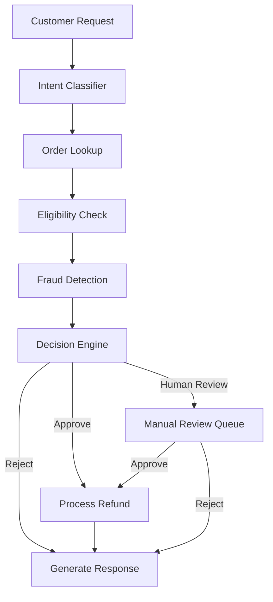
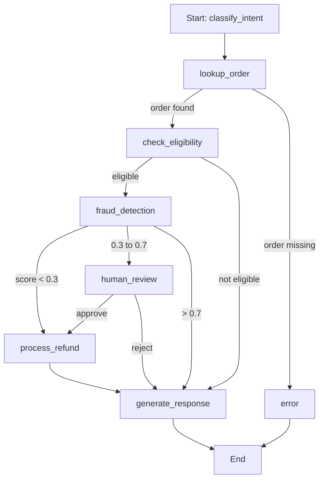

# Refund Guard AI Architecture

A production-style agentic refund decision system for a quick-commerce or e-commerce platform.


## Overview

Refund Guard is a multi-layer refund automation system.  
The API receives a refund request, a LangGraph orchestrator routes it through specialized agents, and a decision engine returns one of three outcomes: approve, reject, or send for human review.

### Core goals

- Automate straightforward refunds.
- Detect suspicious refund behavior.
- Escalate edge cases to human reviewers.
- Maintain a full audit trail.
- Keep latency low for auto-approved cases.

## Architecture Layers

### 1. Presentation Layer

Handles incoming traffic and client communication. 

- FastAPI REST endpoints:
  - `/refund/request`
  - `/refund/status`
- WebSocket for real-time status streaming
- JWT authentication middleware
- Rate limiting 

### 2. Orchestration Layer

Controls the workflow and state transitions. 

- LangGraph `StateGraph` as the master orchestrator
- Conditional routing for approve / review / reject
- Human-in-the-loop interrupt nodes for edge cases
- Retry and error handling 

### 3. Agent Layer

Contains specialized agents that each solve one part of the refund decision process. 

- Intent classification
- Eligibility verification
- Fraud detection
- Refund execution
- Response generation
- RAG policy retrieval support 

### 4. Data Layer

Stores operational, state, and retrieval data. 

- PostgreSQL for orders, refunds, audit logs
- Redis for cache, session state, and deduplication
- Qdrant or pgvector for policy retrieval embeddings 


## End-to-End Flow

The request moves through a fixed state-driven workflow. 



### Request stages

1. Customer submits a refund request from app, chat, or API. 
2. Intent classifier extracts structured information from the free-text request. 
3. Order lookup fetches order details, delivery status, and item information. 
4. Eligibility verifier checks policy rules and return windows. 
5. Fraud detection computes a fraud score using behavior and evidence signals. 
6. Decision engine chooses auto-approve, human review, or auto-reject. 
7. Refund processor triggers payment updates and system writes. 
8. Response generator sends the final customer-facing response. 


## Multi-Agent Design

Each agent is a LangGraph or LangChain node with a clear responsibility and structured output.  
All agents read and update a shared `RefundState` object. 

### 1. Orchestrator Agent

- Receives raw request and initial context
- Builds the initial workflow state
- Routes execution via conditional edges
- Handles retries and aggregated errors 

### 2. Intent Classifier Agent

- Classifies request type: refund, exchange, inquiry, cancel
- Extracts `order_id`, reason, and item details
- Uses structured output with Pydantic schema
- Falls back to rules for low-confidence cases 

### 3. Eligibility Verifier Agent

- Checks refund or return window
- Validates item category eligibility
- Confirms order and delivery state
- Retrieves policy context through RAG for edge cases 

### 4. Fraud Detection Agent

- Computes `fraud_score` from 0 to 1
- Checks refund frequency, claim history, and account age
- Cross-checks delivery evidence or photo uploads
- Detects velocity and duplicate refund patterns 

### 5. Refund Processor Agent

- Calls payment gateway APIs
- Calculates refund amount: full, partial, or store credit
- Updates refund, order, and inventory records
- Supports idempotent retries 

### 6. Response Generator Agent

- Generates customer-facing messages
- Adapts tone for approval vs rejection
- Sends push or email notifications
- Appends audit events for traceability 


## Decision Engine

Decision routing is based on policy eligibility and fraud score thresholds. 

| Outcome | Conditions |
|||
| Auto Approve | Eligible request, within window, low fraud score, common reason, lower-risk order  |
| Human Review | Ambiguous claim, medium fraud score, partial return, outside standard pattern  |
| Auto Reject | Policy violation, duplicate refund, high fraud score, beyond return window  |

### Fraud score thresholds

- `score < 0.3` → auto approve 
- `0.3 <= score < 0.7` → human review 
- `score >= 0.7` → auto reject 


## LangGraph Workflow

The workflow is modeled as a persistent state machine. 



### Routing rules

- If order is missing, route to `error`. 
- If request is not eligible, skip refund processing and go to response generation. 
- If fraud is low, process refund automatically. 
- If fraud is medium, pause for human review. 
- If fraud is high, reject automatically and generate response. 


### API responsibilities

- Accept the incoming refund request
- Initialize graph state
- Execute the LangGraph workflow
- Resume interrupted human-review threads
- Return normalized `RefundResponse` output 


## Fraud Signals

Typical fraud indicators used by the system include: 

- High refund frequency in the last 30 days
- New account age
- Duplicate refund on the same order
- Evidence mismatch from image or vision checks
- Suspicious claim velocity patterns 

### Example scoring logic

- More than 5 recent refunds adds a strong fraud signal. 
- Very new accounts increase risk. 
- A duplicate refund can force the score to the maximum. 
- Evidence mismatch can add additional fraud weight. 


## RAG Usage

Policy retrieval is used inside eligibility checks for non-trivial cases. 

### Typical RAG flow

1. Ingest internal refund policy documents into Qdrant or pgvector. 
2. Embed policy chunks for retrieval. 
3. Retrieve the most relevant policy clauses during eligibility evaluation. 
4. Add retrieved policy context into `state.policy_context`. 

This helps the system handle edge cases without hardcoding every policy branch. 


## Tech Stack

### AI and orchestration

- LangGraph
- LangChain
- GPT-4o-mini for fast inference nodes
- GPT-4o for higher-quality ambiguous summaries
- OpenAI embeddings 

### Backend

- Python 3.11
- FastAPI
- Pydantic v2

### Data

- PostgreSQL
- Redis

### Observability

- LangSmith

### Infra

- Docker


## Project Structure

```bash
refund-guard/
├── .env.example
├── ARCHITECTURE.md
├── README.md
├── pyproject.toml
├── requirements.txt
├── uv.lock
└── backend/
    ├── main.py
    └── agents/
        ├── graph.py
        ├── nodes.py
        ├── prompt.py
        ├── state.py
        └── tools/
            ├── db.py
            └── llm.py
```


## Why LangGraph Fits This System

LangGraph is a strong fit because refund workflows are structured, stateful, and branch-heavy.  
The design specifically benefits from conditional routing, checkpoint persistence, and built-in human interruption support. 

### Compared with alternatives

- **LangGraph**: best for deterministic branching and HITL workflows. 
- LangChain agents alone are less predictable for strict business rules. 
- Pure rule engines are deterministic but weak for natural language and evidence interpretation. 
- CrewAI or similar team-style frameworks are less suitable for rigid refund state machines. 


## GitHub Repo Description

Use this short description in your repository:

> Agentic Refund Guard system using FastAPI, LangGraph, LangChain, PostgreSQL, Redis, and RAG for automated refund approval, fraud detection, and human review workflows. 


## Showcase Points

These are good points to highlight in your GitHub README or portfolio. 

- Multi-agent refund automation workflow
- Fraud scoring with explainable signals
- Human-in-the-loop review architecture
- LangGraph state machine with interrupts
- RAG-backed policy validation
- Production-ready FastAPI integration
- Auditability and retry-safe refund execution 