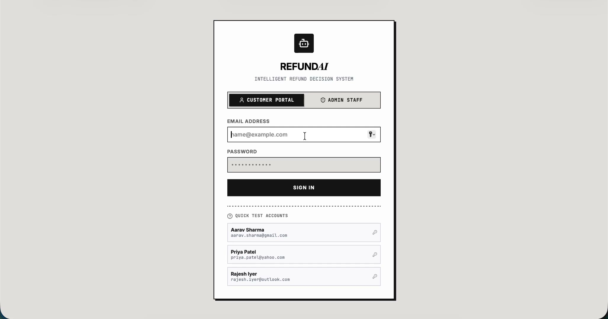
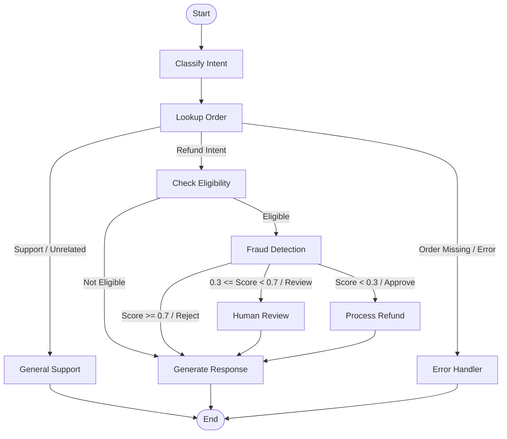
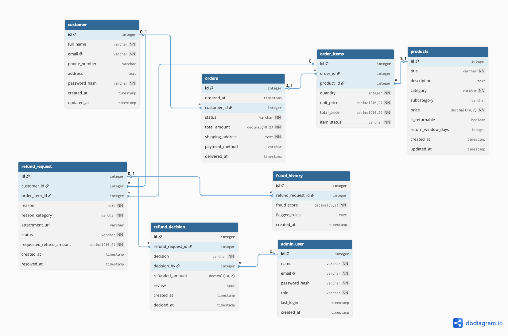
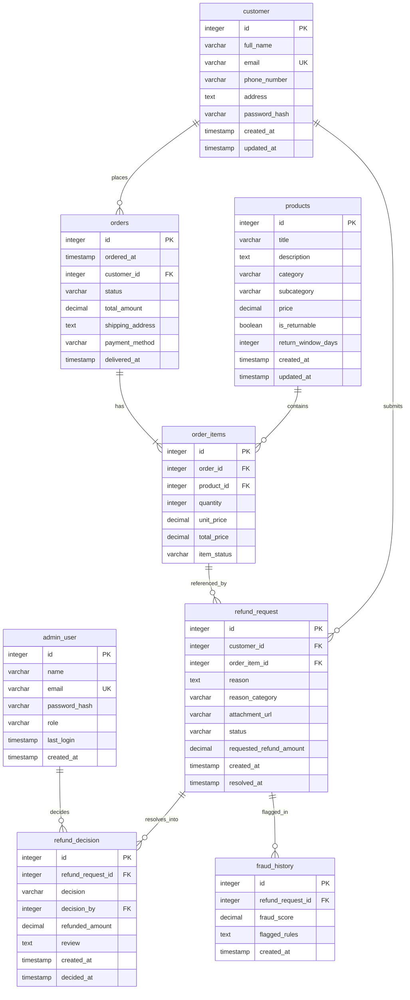

# Refund Guard AI

Refund Guard is an intelligent, agentic refund decision system designed for quick-commerce and e-commerce platforms. Powered by **LangGraph** and **LangChain**, it automates eligibility checks, evaluates fraud risk, coordinates support queue escalations, and executes refund decisions securely.

---

## 🎬 Demo

> Click the thumbnail below to watch the full demo:

[](video.mp4)

---

## System Architecture

The application is structured into four functional layers:
1. **Presentation Layer**: Handles incoming API requests (FastAPI) and WebSocket events.
2. **Orchestration Layer**: Manages the multi-agent execution flow using a state-driven LangGraph pipeline.
3. **Agent Layer**: Hosts specialized agent nodes (Intent Classifier, Eligibility Auditor, Fraud Detector, and Response Generator) equipped with tool access.
4. **Data Layer**: Directs state transitions and data persistence via SQLite (for orders, refund requests, and audit logs) and local vector-retrieval for policy lookups.

---

## Agent Workflow (LangGraph State Machine)

The evaluation follows a deterministic, stateful workflow modeled in `backend/agents/graph.py`:



### Flow Node Descriptions:
- **Classify Intent**: Analyzes customer free-text query to extract the intent category (`refund_related`, `general_support`, or `unrelated`).
- **Lookup Order**: Retrieves order and customer metadata from the SQLite database.
- **General Support**: Handles non-refund queries like order status, tracking, ETA, and payment info. Includes strict guardrails to prevent unrelated conversation drift (e.g., coding help, roleplay).
- **Check Eligibility**: Cross-references order timelines and items against `refund-policy.md` utilizing RAG/grep tools.
- **Fraud Detection**: Computes a fraud score based on customer history, duplicate attempts, and evidence validation.
- **Process Refund**: Dynamically calculates the final credit amount and writes approved refund decisions.
- **Human Review**: Marks suspicious or boundary claims as `pending_review` in the database to be resolved by support agents.
- **Generate Response**: Constructs context-appropriate, customer-friendly status messages.

---

## Frontend Application Flow

The frontend is a React-based Single Page Application (SPA) that provides tailored experiences for customers and administrative staff.

### 1. Authentication & Routing
- **Login**: A unified login page handles both customers and admin users via JWT-based authentication.
- **Conditional Views**:
    - **Customers**: Redirected to the `CustomerChat` portal for real-time support and refund requests.
    - **Admin Staff**: Redirected to the `AdminDashboard` for system monitoring and manual decision overrides.

### 2. Customer Portal (`CustomerChat`)
- **Real-time Interaction**: A chat-based interface for interacting with the AI agents.
- **Support Requests**: Users can inquire about order status or submit refund claims with evidence.
- **Order History**: Allows selection of specific order items for precise intent classification.

### 3. Admin Dashboard (`AdminDashboard`)
The admin interface is organized into three primary views:
- **Overview**:
    - **KPIs**: Displays real-time metrics including Auto-Approval Success Rate, Average Resolution Speed, and Total Decisions.
    - **Live Decision Logs**: A streaming feed of AI-generated decisions and reasoning audits.
    - **Review Queue Snippet**: Quick access to the most urgent pending reviews.
- **Queue Tasks**:
    - **Manual Override**: Lists all refund requests flagged for human review.
    - **Fraud Analysis**: Displays fraud scores and specific signals (e.g., "high frequency", "duplicate claim") to aid in decision-making.
    - **Decision Controls**: Allows staff to Approve or Reject claims, which immediately updates the customer's status.
- **AI Logs**:
    - **Audit Trail**: A comprehensive, searchable table of all system-processed refund requests, decisions, and detailed LLM reasoning audits.

---

## Support Guardrails & Intent Handling

To maintain system focus and efficiency, the assistant employs multi-layer guardrails:
1. **Intent Classification**: Every query is categorized. Non-e-commerce intents (coding, stories, personal advice) are flagged as `unrelated`.
2. **Conversation Drift Protection**: The `general_support` node tracks an `unrelated_msg_count`. If a user persists in off-topic discussion, the assistant becomes increasingly firm in redirecting them to order assistance.
3. **Information Siloing**: Refund logic is strictly decoupled from general support. Refund-related keywords always trigger the specialized audit pipeline.

---

## Database Schema & ER Diagram

The database runs on SQLite (`mock.db`). The entity-relationship design supports full audit trails and historical analysis for fraud detection.

### Visual ER Diagram
Below is the visual database mapping of the entities:



### Logical ER Model (Mermaid Diagram)



---

## How to Set Up & Run Tests

### 1. Configure Environment
Copy `.env.example` to `.env` and fill in your OpenAI API credentials:
```bash
cp .env.example .env
```
Ensure `.env` contains:
```env
OPENAI_BASE_URL=https://api.openai.com/v1
OPENAI_MODEL=gpt-4o-mini
OPENAI_API_KEY=your-openai-api-key
OPENAI_VISION_MODEL=gpt-4o-mini
```

### 2. Activate Environment
Initialize and activate your virtual environment:
```bash
source .venv/bin/activate
```

### 3. Run the Verification Suite
You can run the verification suite in two ways:

#### A. Run as Pytest (Recommended)
The test scenarios (Auto-Approve, Auto-Reject, Escalated Human Review, Non-Returnable Category, Missing Order ID, and Duplicate Request) have been converted to a pytest suite. To run the suite:
```bash
pytest -v backend/cli_test.py
```
To run the suite and display the `rich` color-coded console panels and step-by-step audit tables:
```bash
pytest -s -v backend/cli_test.py
```

#### B. Run the main.py entrypoint
To execute the main backend runner:
```bash
uv run backend/main.py
```

